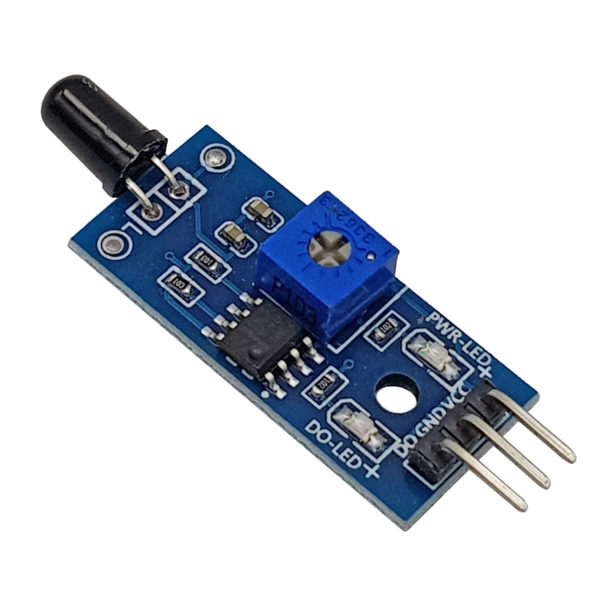

1. **Cảm biến lửa**
=========

Cảm biến phát hiện lửa thường được sử dụng trong hệ thông báo cháy. Tầm phát hiện trong khoảng 80cm, góc quét là 60 độ. Có thể phát hiện lửa tốt nhất là loại có bước sóng từ 760nm – 1100nm. Mạch được tích hợp IC LM393 so sánh để tạo mức tín hiệu. Ta có thể chỉnh độ nhạy bằng biến trở..

|

.. 