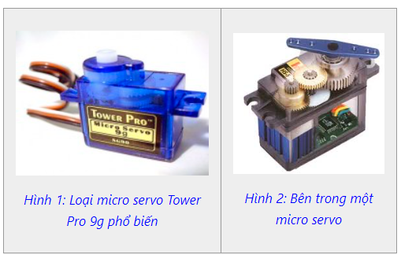

1. **Động cơ servo SG90**
=========

Servo là một dạng động cơ điện đặc biệt. Không giống như động cơ thông thường cứ cắm điện vào là quay liên tục, servo chỉ quay khi được điều khiển (bằng xung PPM) với góc quay nằm trong khoảng bất kì từ 0o - 180o. Mỗi loại servo có kích thước, khối lượng và cấu tạo khác nhau. Có loại thì nặng chỉ 9g (chủ yếu dùng trên máy bay mô mình), có loại thì sở hữu một momen lực bá đạo (vài chục Newton/m), hoặc có loại thì khỏe và nhông sắc chắc chắn,...

|

Động cơ servo được thiết kế những hệ thống hồi tiếp vòng kín. Tín hiệu ra của động cơ được nối với một mạch điều khiển. Khi động cơ quay, vận tốc và vị trí sẽ được hồi tiếp về mạch điều khiển này. Nếu có bầt kỳ lý do nào ngăn cản chuyển động quay của động cơ, cơ cấu hồi tiếp sẽ nhận thấy tín hiệu ra chưa đạt được vị trí mong muốn. Mạch điều khiển tiếp tục chỉnh sai lệch cho động cơ đạt được điểm chính xác. Các động cơ servo điều khiển bằng liên lạc vô tuyến được gọi là động cơ servo RC (radio-controlled). Trong thực tế, bản thân động cơ servo không phải được điều khiển bằng vô tuyến, nó chỉ nối với máy thu vô tuyến trên máy bay hay xe hơi. Động cơ servo nhận tín hiệu từ máy thu này.

.. 