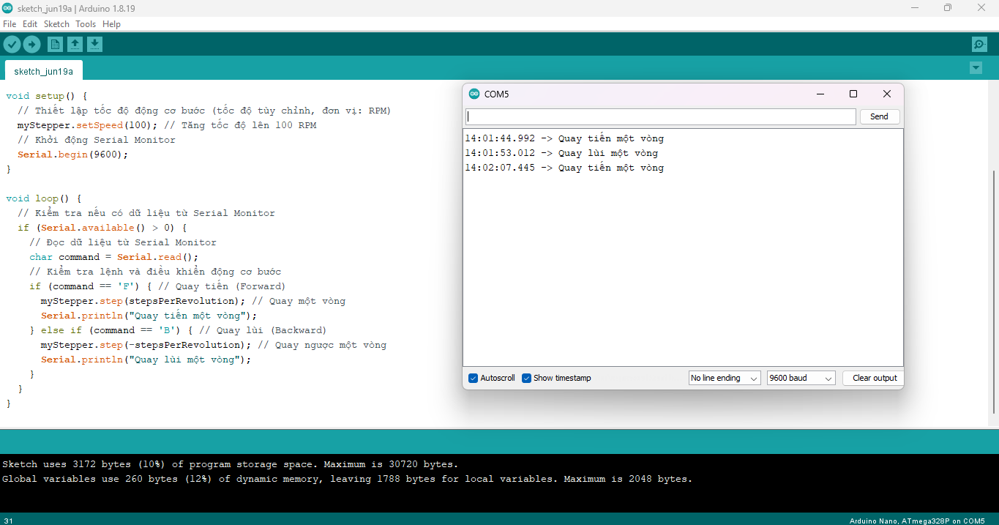

4. **Hướng dẫn lập trình**
=========

   #include <Stepper.h>

   // Số bước cho mỗi vòng quay của động cơ (số bước phụ thuộc vào loại động cơ bạn sử dụng)
   const int stepsPerRevolution = 2048; // Số bước cho động cơ 28BYJ-48

   // Khởi tạo đối tượng Stepper với số bước mỗi vòng quay và chân điều khiển
   Stepper myStepper(stepsPerRevolution, 8, 10, 9, 11);

   void setup() {
   // Thiết lập tốc độ động cơ bước (tốc độ tùy chỉnh, đơn vị: RPM)
   myStepper.setSpeed(100); // Tăng tốc độ lên 100 RPM

   // Khởi động Serial Monitor
   Serial.begin(9600);
   }

   void loop() {
      // Kiểm tra nếu có dữ liệu từ Serial Monitor
      if (Serial.available() > 0) {
         // Đọc dữ liệu từ Serial Monitor
         char command = Serial.read();

         // Kiểm tra lệnh và điều khiển động cơ bước
         if (command == 'F') {
            // Quay tiến (Forward)
            myStepper.step(stepsPerRevolution); // Quay một vòng
            Serial.println("Quay tiến một vòng");
         } else if (command == 'B') {
            // Quay lùi (Backward)
            myStepper.step(-stepsPerRevolution); // Quay ngược một vòng
            Serial.println("Quay lùi một vòng");
         }
      }
   }

Sau khi nạp code xong chúng ta ấn **Ctrl + Shift + M** để mở cửa sổ **Serial Monitor** và xem kết quả. Ấn “F” hoặc “B” để điều khiển động cơ bước

|

.. 