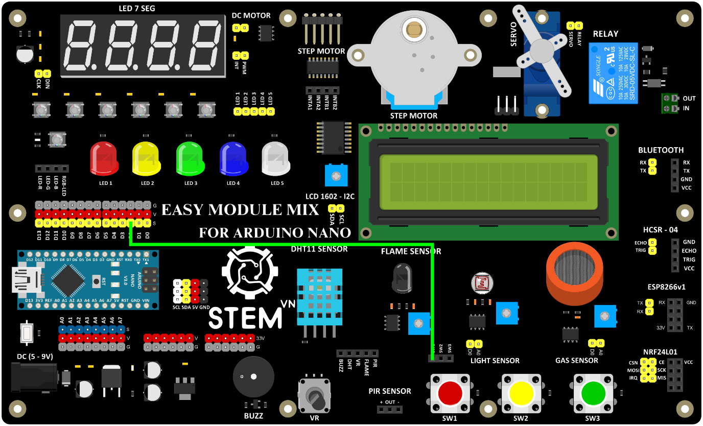

3. **Sơ đồ kết nối**
========

Dùng dây jump cái cái để kết nối chân S của D2 với chân SW1 (hoặc có thể nối chân D2 với một trong các chân còn lại từ 2 - 5)

+-----------------------------------+-----------------------------------+
| **NÚT NHẤN**                      | **ARDUINO**                       |
+===================================+===================================+
| SW1                               | D2                                |
+-----------------------------------+-----------------------------------+

|

.. 