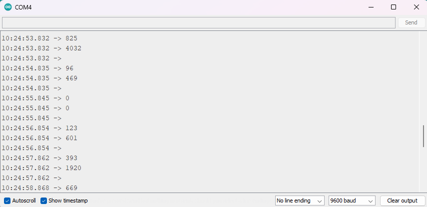
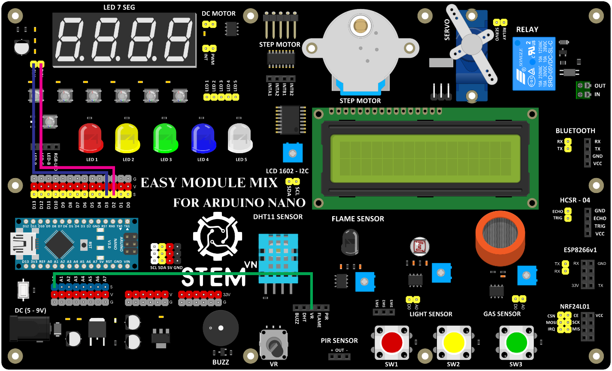

4. **Hướng dẫn lập trình**
=======

.. code-block:: cpp

   void setup() {
      Serial.begin(9600); //Mở cổng Serial để giao tiếp
   }
   void loop() {
      int value = analogRead(A0); //đọc giá trị điện áp ở chân A0
      //(value luôn nằm trong khoảng 0-1023)

      Serial.println(value); //xuất ra giá trị vừa đọc

      int voltage;
      voltage = map(value,0,1023,0,5000); //chuyển thang đo của value
      //từ 0-1023 sang 0-5000 (mV)

      Serial.println(voltage); //xuất ra điện áp (đơn vị là mV)
      Serial.println(); //xuống hàng

      delay(1000); //đợi 1 giây
   }

Sau khi nạp code xong chúng ta ấn **Ctrl + Shift + M** để mở cửa sổ **Serial Monitor** và xem kết quả. Xoay biến trở sẽ thấy giá trị thay đổi.

|

Chúng ta cũng có thể hiển thị giá trị điện áp bằng LED 7 thanh như sau:

-  Sơ đồ kết nối:

Biến trở
   +----------------------------------+-----------------------------------+
   | **BIẾN TRỞ**                     | **ARDUINO**                       |
   +==================================+===================================+
   | VR                               | A0                                |
   +----------------------------------+-----------------------------------+

LED 7 thanh
   +---------------------------------+------------------------------------+
   | **LED 7 THANH**                 | **ARDUINO**                        |
   +=================================+====================================+
   | CLK                             | D3                                 |
   +---------------------------------+------------------------------------+
   | DIN                             | D2                                 |
   +---------------------------------+------------------------------------+

|

Hướng dẫn lập trình:

.. code-block:: cpp

   #include <TM1637Display.h>

   #define CLK 3 // Định nghĩa CLK là chân 3 (chân Clock kết nối với chân D3 của Arduino)
   #define DIO 2 // Định nghĩa DIO là chân 2 (chân Data In kết nối với chân D2 của Arduino)

   TM1637Display display(CLK, DIO);

   void setup() {
      // Thiết lập độ sáng của màn hình
      // 0x0f thiết lập độ sáng tối đa (phạm vi từ 0-7 cho độ sáng)
      display.setBrightness(0x0f);
   }
   void loop() {
      // Đọc giá trị điện áp ở chân A0
      int value = analogRead(A0);

      // Chuyển đổi giá trị từ thang đo 0-1023 sang 0-5000 mV
      int voltage = map(value, 0, 1023, 0, 5000);

      // Hiển thị giá trị điện áp (đơn vị là mV) lên màn hình 7 đoạn
      display.showNumberDec(voltage);

      // Đợi 1 giây trước khi lặp lại
      delay(1000);
   }

.. note::

   - **display.showNumberDec(voltage)**: Hiển thị giá trị số nguyên lên màn hình 7 đoạn.

   - **delay(1000)**: Đợi 1 giây trước khi lặp lại.

..