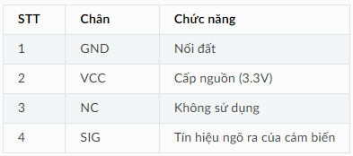

2. **Thông số kỹ thuật**
========

Thông số kỹ thuật của cảm biến nhiệt độ độ ẩm DHT11
   -  Điện áp đầu vào: 3.3V
   -  Khoảng giá trị dòng điện: 1.3 – 2.1 mA
   -  Khoảng giá trị độ ẩm: 5% – 95% RH
   -  Khoảng giá trị nhiệt độ: -20 – 60 ℃

Cảm biến nhiệt độ và độ ẩm DHT11 có 4 chân, và mỗi chân có chức năng như sau:

|

.. 