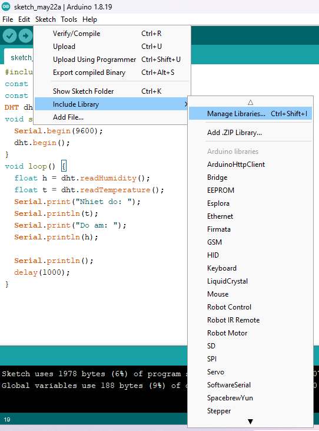
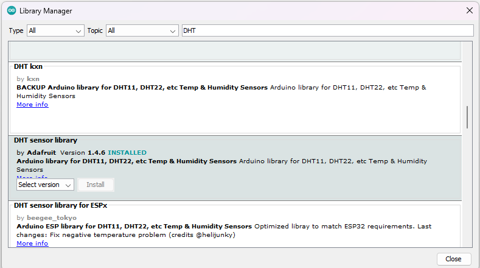
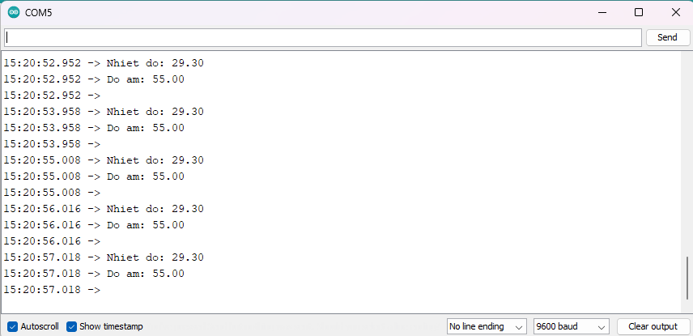

4. **Hướng dẫn lập trình**
========

Trước khi lập trình chúng ta cần phải cài thư viện DHT.h. Chúng ta sẽ vào theo chỉ dẫn sau:

   Sketch => Include Library => Manage Libraries…

|

Bảng Library Manager hiện ra chúng ta nhập DHT => Enter. Sau đó kéo xuống tìm thư viện DHT sensor library và ấn Install.

|

Code mẫu hiển thị giá trị nhiệt độ, độ ẩm lên Serial Monitor:

   // Gọi thư viện DHT11
   #include "DHT.h"

   const int DHTPIN = 2; //Đọc dữ liệu từ DHT11 ở chân 2 trên mạch Arduino
   const int DHTTYPE = DHT11; //Khai báo loại cảm biến, có 2 loại là DHT11 và DHT22

   DHT dht(DHTPIN, DHTTYPE);

   void setup() {
      Serial.begin(9600);
      dht.begin(); // Khởi động cảm biến
   }
   void loop() {
      float h = dht.readHumidity(); //Đọc độ ẩm
      float t = dht.readTemperature(); //Đọc nhiệt độ
      Serial.print("Nhiet do: ");
      Serial.println(t); //Xuất nhiệt độ
      Serial.print("Do am: ");
      Serial.println(h); //Xuất độ ẩm
      Serial.println(); //Xuống hàng
      delay(1000); //Đợi 1 giây
   }

Sau khi upload chương trình lên mạch Arduino, bạn hãy bấm Ctrl + Shift + M để mở cửa sổ Serial Monitor và xem kết quả.

|

.. 
