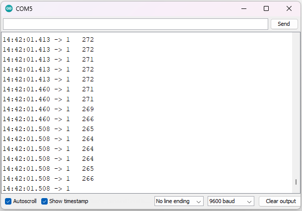

4. **Hướng dẫn lập trình**
========

void setup() {
   Serial.begin(9600);
}
void loop() {
   Serial.print(digitalRead(8));//hiển thị giá trị chân 8
   Serial.print(" ");
   Serial.println(analogRead(A0));//hiển thị giá trị chân A0
}

Sau khi upload chương trình lên mạch Arduino, bạn hãy bấm Ctrl + Shift + M để mở cửa sổ Serial Monitor và xem kết quả.

|

.. 
