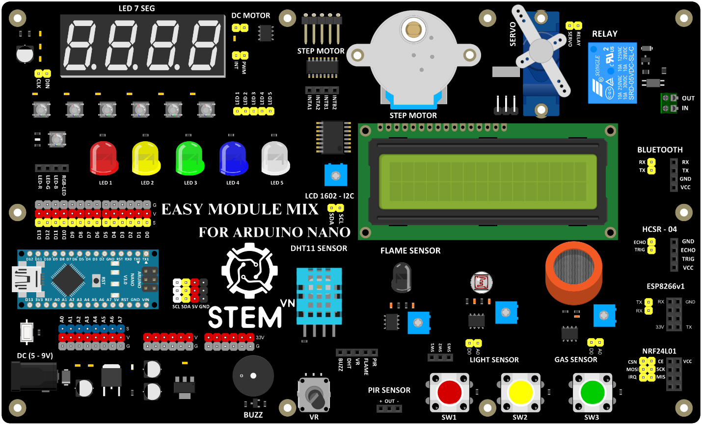

1. **Giới thiệu EASY MODULE MIX FOR ARDUINO NANO là gì?**
=========

Easy Module Mix for Arduino Nano là một tập hợp các mô-đun linh hoạt
được thiết kế để mở rộng chức năng của bo mạch vi điều khiển Arduino
Nano. Bao gồm nhiều mô-đun cảm biến, bộ truyền động và các thành phần
khác có thể dễ dàng tích hợp vào các dự án Arduino của bạn, cho phép bạn
xây dựng nhiều loại thiết bị tương tác và nguyên mẫu.

Các mô-đun này đi kèm với các đầu nối hoặc đầu cắm được tiêu chuẩn hóa,
giúp chúng dễ dàng kết nối với Arduino Nano mà không cần hàn hoặc nối
dây phức tạp. Một số mô-đun phổ biến được tìm thấy trong Easy Module Mix
có thể bao gồm cảm biến nhiệt độ và độ ẩm, cảm biến chuyển động, cảm
biến ánh sáng, màn hình LED, động cơ, v.v.

Với Easy Module Mix, bạn có thể nhanh chóng thử nghiệm các cảm biến và
bộ truyền động khác nhau, cho phép bạn tìm hiểu về các khía cạnh khác
nhau của điện tử và lập trình đồng thời tạo ra các dự án thú vị và thiết
thực. Cho dù bạn là người mới bắt đầu muốn bắt đầu với Arduino hay một
nhà sản xuất có kinh nghiệm đang tìm cách mở rộng bộ công cụ của mình,
Easy Module Mix đều cung cấp một cách thuận tiện và dễ tiếp cận để nâng
cao các dự án của bạn.

.. 