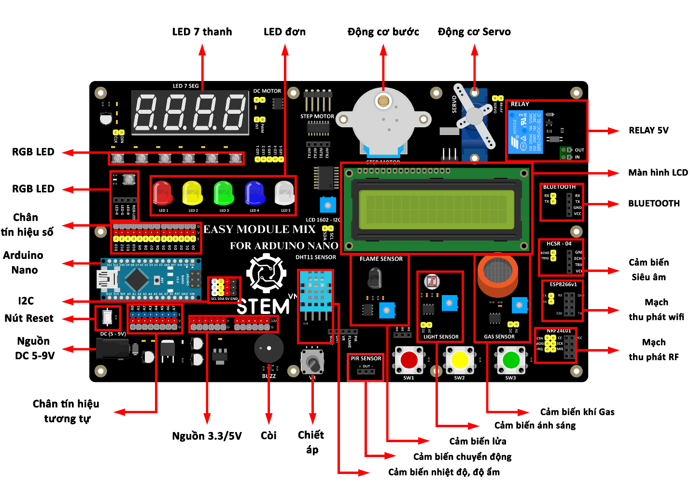

2. **Cấu tạo của EASY MODULE MIX FOR ARDUINO NANO**
=========

|

Easy Module Mix for Arduino Nano thường bao gồm một loạt các mô-đun cảm biến, hoạt động và các thành phần khác được thiết kế để mở rộng tính năng của bo mạch điều khiển Arduino Nano:
   -  Cảm biến nhiệt độ và độ ẩm: Cung cấp dữ liệu về nhiệt độ và độ ẩm của
      môi trường xung quanh.
   -  Cảm biến chuyển động (PIR): Phát hiện chuyển động trong một phạm vi
      cụ thể và thường được sử dụng để kích hoạt các hệ thống bảo mật hoặc
      điều khiển ánh sáng tự động.
   -  Cảm biến khí gas: sử dụng để kiểm tra khí gas trong môi trường.
   -  Cảm biến ánh sáng: Dùng để đo mức độ ánh sáng trong môi trường xung
      quanh.
   -  Màn hình LCD: Hiển thị dữ liệu hoặc thông báo.
   -  Động cơ bước và động cơ Servo: Cho phép bạn điều khiển chuyển động
      của các thiết bị vật lý như bánh xe hoặc cánh cửa.
   -  Bộ chuyển đổi điện áp: Cung cấp nguồn điện ổn định cho các mô-đun và
      bo mạch khác.
   -  Bộ chuyển đổi giao tiếp: Cho phép Arduino Nano giao tiếp với các
      thiết bị ngoại vi khác như cảm biến hoặc màn hình.
   -  Các mạch mở rộng khác: Có thể bao gồm các mô-đun đọc thẻ nhớ, mô-đun
      kết nối không dây, hoặc các mô-đun khác để mở rộng khả năng của dự
      án.

Cấu trúc chính của Easy Module Mix là sự kết hợp của các mô-đun này với Arduino Nano, cho phép bạn tạo ra các ứng dụng và dự án sáng tạo một cách dễ dàng và linh hoạt.

.. 