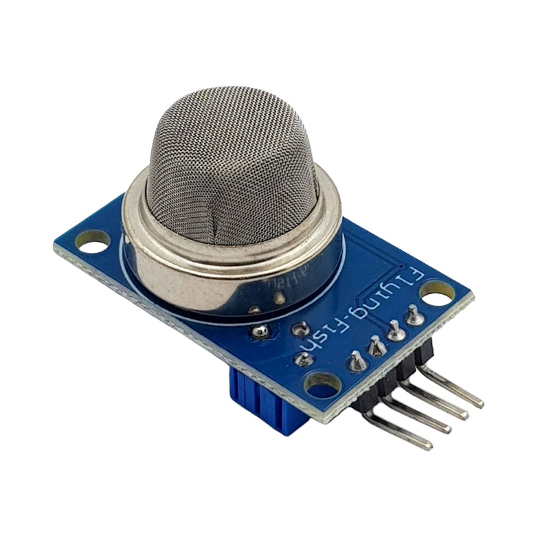

1. **Cảm biến khí gas**
=========

Cảm biến khí gas sử dụng phần tử SnO2 có độ dẫn điện thấp hơn trong không khí sạch, khi khí dễ cháy tồn tại, cảm biến có độ dẫn điện cao hơn, nồng độ chất dễ cháy càng cao thì độ dẫn điện của SnO2 sẽ càng cao và được tương ứng chuyển đổi thành mức tín hiệu điện.

|

Cảm biến khí gas là cảm biến khí có độ nhạy cao với LPG, Propane Hydrogen, mê-tan (CH4) và hơi dễ bắt lửa khác, với chi phí thấp và phù hợp cho các ứng dụng khác nhau.
Cảm biến xuất ra cả hai dạng tín hiệu là Analog và Digital, tín hiệu Digital có thể điều chỉnh mức báo bằng biến trở.