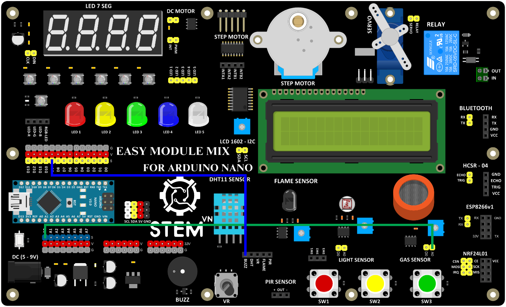

5. **Báo động khi giá trị khí gas vượt ngưỡng cho phép**
=========

-  Sơ đồ kết nối:

..

   Cảm biến khí gas:

+-----------------------------------+-----------------------------------+
| **CẢM BIẾN KHÍ GAS**              | **ARDUINO**                       |
+===================================+===================================+
| A0                                | A0                                |
+-----------------------------------+-----------------------------------+

..

   Còi 5V

+-----------------------------------+-----------------------------------+
| **CÒI 5V**                        | **ARDUINO**                       |
+===================================+===================================+
| BUZZ                              | D9                                |
+-----------------------------------+-----------------------------------+

-  Hướng dẫn lập trình:

..

   const int gasSensorPin = A0; // Pin analog đọc dữ liệu từ cảm biến

   const int threshold = 500; // Ngưỡng cho phép

   const int buzzerPin = 9; // Pin kết nối buzzer

   void setup() {

   pinMode(gasSensorPin, INPUT);

   pinMode(buzzerPin, OUTPUT);

   }

   void loop() {

   // Đọc giá trị từ cảm biến

   int gasValue = analogRead(gasSensorPin);

   // So sánh với ngưỡng cho phép

   if (gasValue > threshold) {

   // Kích hoạt báo động

   digitalWrite(buzzerPin, HIGH);

   delay(1000); // Đợi 1 giây

   digitalWrite(buzzerPin, LOW);

   delay(1000); // Đợi 1 giây

   }

   }