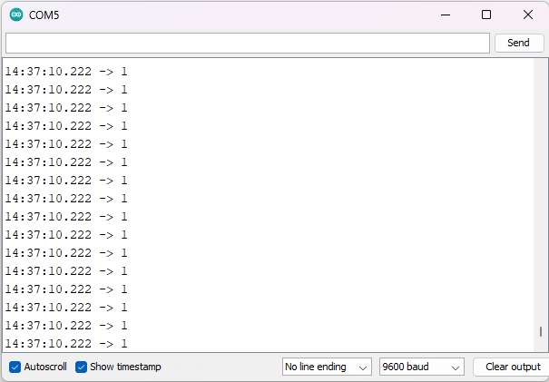

4. **Hướng dẫn lập trình**
===

..

   void setup()

   {

   Serial.begin(9600);

   }

   void loop()

   {

   Serial.println(digitalRead(9));

   }

Sau khi upload chương trình lên mạch Arduino, bạn hãy bấm Ctrl + Shift +
M để mở cửa sổ Serial Monitor và xem kết quả.

