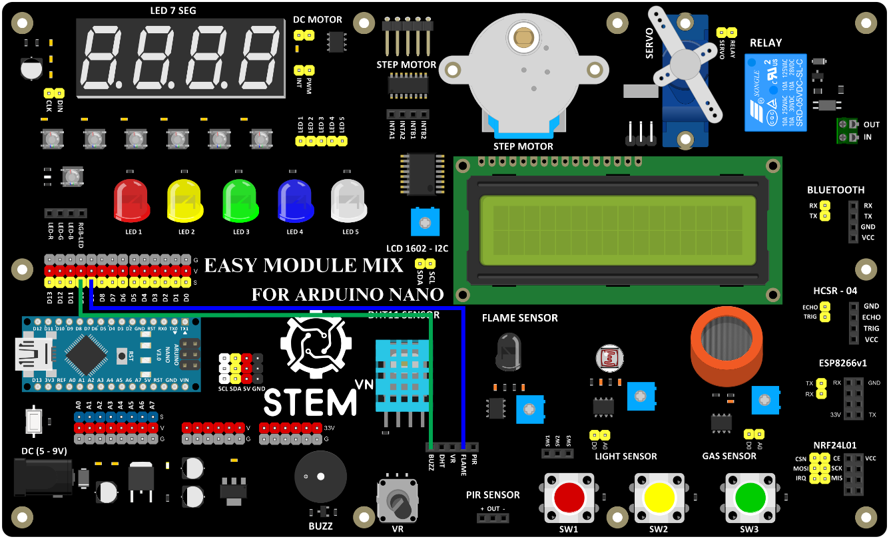

5. **Kích hoạt còi báo khi phát hiện lửa**
=========

-  Sơ đồ kết nối

Cảm biến lửa

+-----------------------------------+-----------------------------------+
| **CẢM BIẾN LỬA**                  | **ARDUINO**                       |
+===================================+===================================+
| FLAME                             | D9                                |
+-----------------------------------+-----------------------------------+

Còi 5V

+-----------------------------------+-----------------------------------+
| **CÒI 5V**                        | **ARDUINO**                       |
+===================================+===================================+
| BUZZ                              | D10                               |
+-----------------------------------+-----------------------------------+

-  Hướng dẫn lập trình

..

   // Khai báo các chân

   const int flameSensorPin = 9; // Chân cảm biến lửa

   const int buzzerPin = 10; // Chân còi

   void setup() {

   // Thiết lập chân cảm biến lửa là đầu vào

   pinMode(flameSensorPin, INPUT);

   // Thiết lập chân còi là đầu ra

   pinMode(buzzerPin, OUTPUT);

   // Tắt còi ban đầu

   digitalWrite(buzzerPin, LOW);

   }

   void loop() {

   // Đọc giá trị từ cảm biến lửa

   int flameState = digitalRead(flameSensorPin);

   if (flameState == LOW) { // Khi có lửa, cảm biến sẽ gửi tín hiệu LOW

   digitalWrite(buzzerPin, HIGH); // Bật còi

   } else {

   digitalWrite(buzzerPin, LOW); // Tắt còi

   }

   delay(100); // Đợi 100ms trước khi đọc lại giá trị

   }

.. 