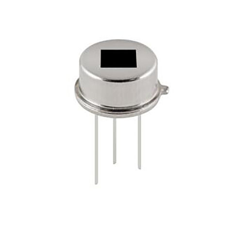

1. **Cảm biến chuyển động**
=========

PIR là chữ viết tắt của Passive InfraRed sensor (PIR sensor), tức là bộ
cảm biến thụ động dùng nguồn kích thích là tia hồng ngoại. Tia hồng
ngoại (IR) chính là các tia nhiệt phát ra từ các vật thể nóng. Trong các
cơ thể sống, trong chúng ta luôn có thân nhiệt (thông thường là ở 37 độ
C), và từ cơ thể chúng ta sẽ luôn phát ra các tia nhiệt, hay còn gọi là
các tia hồng ngoại, người ta sẽ dùng một tế bào điện để chuyển đổi tia
nhiệt ra dạng tín hiệu điện và nhờ đó mà có thể làm ra cảm biến phát
hiện các vật thể nóng đang chuyển động. Cảm biến này gọi là thụ động vì
nó không dùng nguồn nhiệt tự phát (làm nguồn tích cực, hay chủ động) mà
chỉ phụ thuộc vào các nguồn tha nhiệt, đó là thân nhiệt của các thực thể
khác, như con người con vật…

   Original Factory, 3pin Pir Sensor, Pyroelectric Infrared Sensor, Pir
   Motion Sensor N219s - Buy China Wholesale 2 Elements Analog Pir
   Sensor 3 Pins $0.56 \| Globalsources.com
   :width: 2.44293in
   :height: 3.53125in

.. 