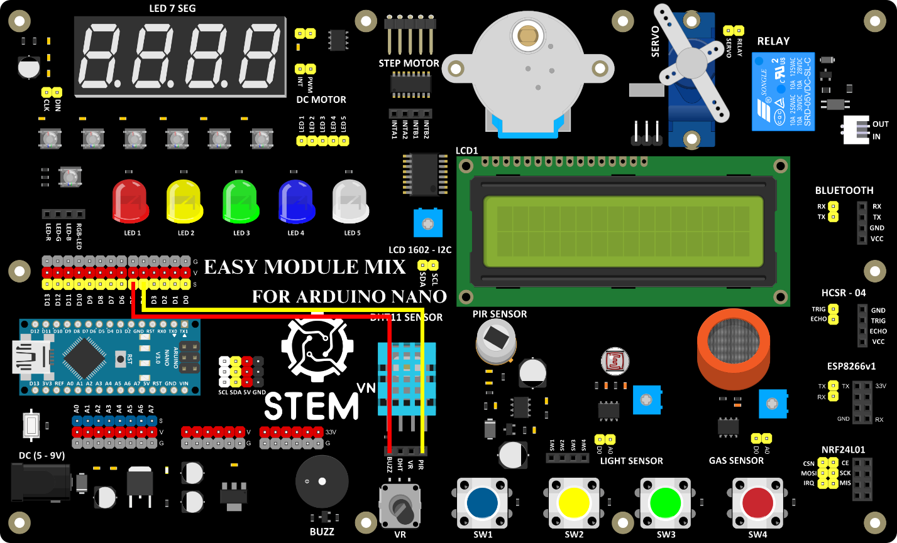

4. **Kích hoạt còi báo khi phát hiện chuyển động**
=========

-  Dưới đây là một chương trình mẫu kích hoạt còi báo khi phát hiện
   chuyển động.

-  Sơ đồ kết nối

-  Hướng dẫn lập trình

..

   // Khai báo chân cho cảm biến chuyển động và loa còi chip

   int motionSensorPin = 4; // Chân kết nối cảm biến chuyển động PIR

   int buzzerControlPin = 5; // Chân kết nối loa còi chip

   void setup() {

   pinMode(motionSensorPin, INPUT); // Đặt chân cảm biến chuyển động là
   INPUT

   pinMode(buzzerControlPin, OUTPUT); // Đặt chân điều khiển loa là
   OUTPUT

   }

   void loop() {

   int motion = digitalRead(motionSensorPin); // Đọc giá trị từ cảm biến
   chuyển động

   if (motion == HIGH) { // Nếu phát hiện chuyển động

   digitalWrite(buzzerControlPin, HIGH); // Kích hoạt loa còi chip

   delay(1000); // Kích hoạt trong 1 giây

   digitalWrite(buzzerControlPin, LOW); // Tắt loa còi chip

   delay(2000); // Đợi 2 giây trước khi kiểm tra lại

   }

   }

.. 