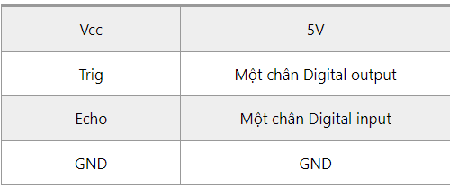

1. **Cảm biến siêu âm HC-SR04**
=========

Cảm biến khoảng cách siêu âm HC-SR04 được sử dụng rất phổ biến để xác định khoảng cách. Cảm biến sử dụng sóng siêu âm và có thể đo khoảng cách trong khoảng từ 2 -> 300 cm, với độ chính xác gần như chỉ phụ thuộc vào cách lập trình.
Cảm biến HC-SR04 có 4 chân là: Vcc, Trig, Echo, GND.

|

Nguyên lý hoạt động:
   -  Để đo khoảng cách, ta sẽ phát 1 xung rất ngắn (5 microSeconds - µs) từ chân Trig. Sau đó, cảm biến sẽ tạo ra 1 xung HIGH ở chân Echo cho đến khi nhận lại được sóng phản xạ ở pin này. Chiều rộng của xung sẽ bằng với thời gian sóng siêu âm được phát từ cảm biển và quay trở lại.

   -  Tốc độ của âm thanh trong không khí là 340 m/s (hằng số vật lý), tương đương với 29,412 microSeconds/cm (106 / (340*100)). Khi đã tính được thời gian, ta sẽ chia cho 29,412 để nhận được khoảng cách.

.. 