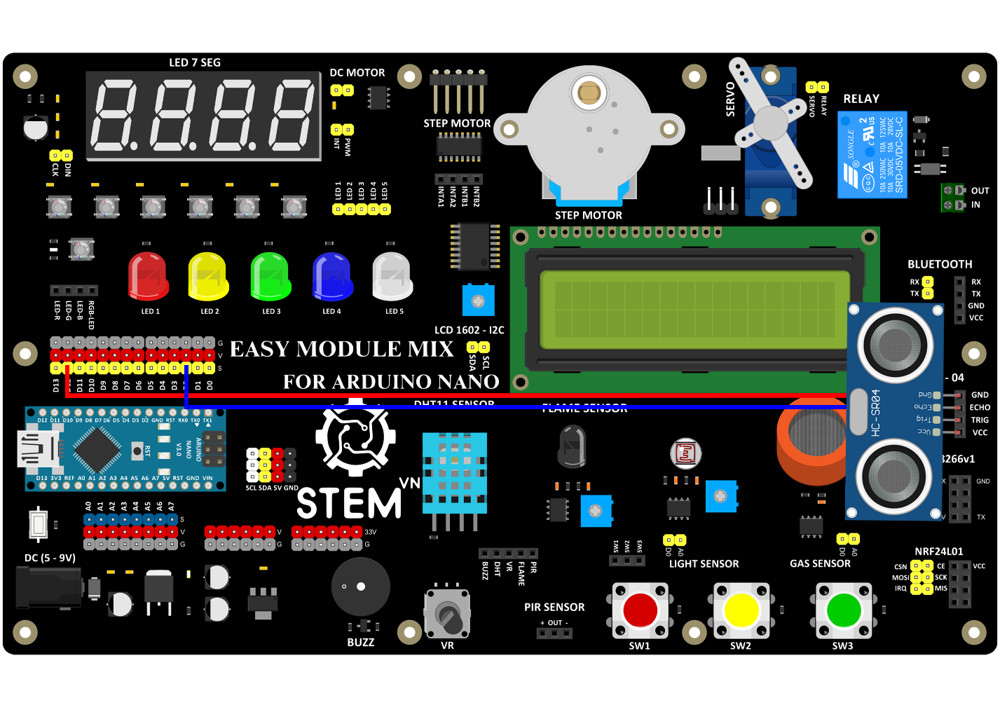

3. **Sơ đồ kết nối**
===

-  Sơ đồ kết nối

+-----------------------------------+-----------------------------------+
| **CẢM BIẾN SIÊU ÂM**              | **ARDUINO**                       |
+===================================+===================================+
| GND                               | GND                               |
+-----------------------------------+-----------------------------------+
| VCC                               | VCC                               |
+-----------------------------------+-----------------------------------+
| TRIG                              | D2                                |
+-----------------------------------+-----------------------------------+
| ECHO                              | D12                               |
+-----------------------------------+-----------------------------------+

