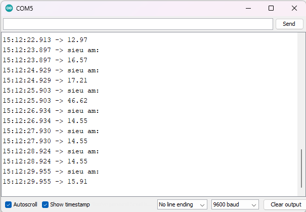

4. **Hướng dẫn lập trình**
===

-  Code hiển thị khoảng cách đo được từ cảm biến siêu âm lên Serial

..

   float getDistance(int trig,int echo){

   float dem=0;

   pinMode(trig,OUTPUT);

   digitalWrite(trig,LOW);

   delayMicroseconds(2);

   digitalWrite(trig,HIGH);

   delayMicroseconds(10);

   digitalWrite(trig,LOW);

   pinMode(echo, INPUT);

   dem = pulseIn(echo,HIGH,30000)/58.0;

   if(dem==0) dem=30;

   return dem;

   }

   void setup() {

   Serial.begin(9600);

   }

   void loop() {

   Serial.println("sieu am:");

   Serial.println((getDistance(2,12)));

   delay(1000);

   }

Sau khi nạp code xong chúng ta ấn **Ctrl + Shift + M** để mở cửa sổ
**Serial Monitor** và xem kết quả.

