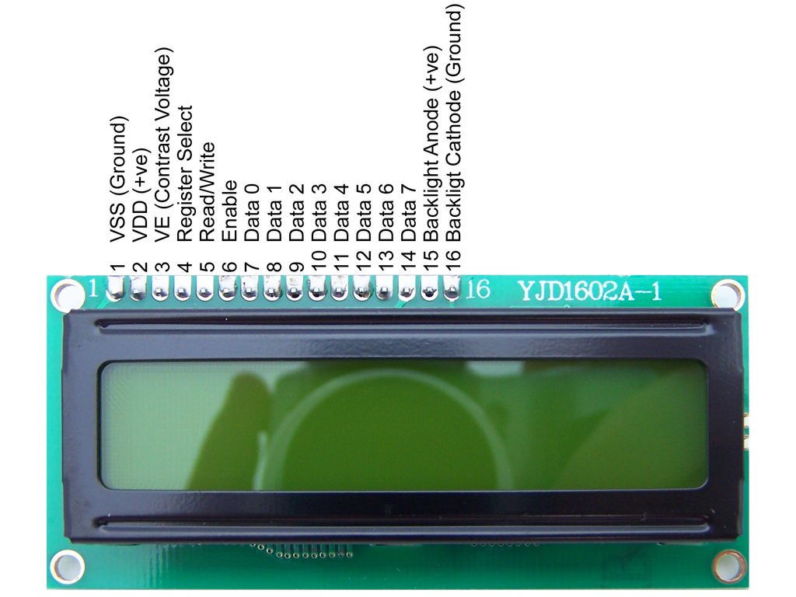

1. **Màn hình LCD 1602**
=========

Màn hình LCD 16×2 là một loại màn hình ký tự thông dụng trong các dự án
điện tử. Nó có khả năng hiển thị 16 cột và 2 hàng của các ký tự.

Màn hình này sử dụng công nghệ hiển thị Liquid Crystal Display (LCD) để
hiển thị thông tin. Nó có thể hiển thị các ký tự từ bảng mã ASCII và có
thể hiển thị các ký tự chữ cái, chữ số, ký tự đặc biệt và các biểu tượng
khác.

**Thông số kỹ thuật:**

-  LCD 1602 được sử dụng để hiển thị trạng thái hoặc các thông số.

-  LCD 1602 có 16 chân trong đó 8 chân dữ liệu (D0 – D7) và 3 chân điều
   khiển (RS, RW, EN).

-  5 chân còn lại dùng để cấp nguồn và đèn nền cho LCD 16×2.

-  Các chân điều khiển giúp ta dễ dàng cấu hình LCD ở chế độ lệnh hoặc
   chế độ dữ liệu.

-  Chúng còn giúp ta cấu hình ở chế độ đọc hoặc ghi.

-  LCD 1602 có thể sử dụng ở chế độ 4 bit hoặc 8 bit tùy theo ứng dụng
   ta đang làm.

.. 