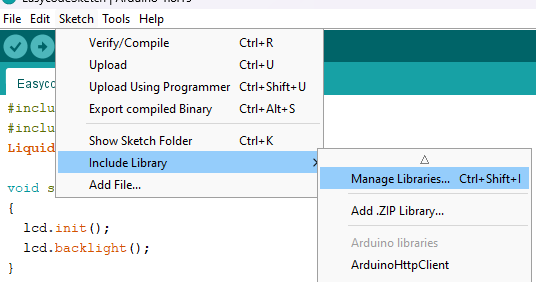
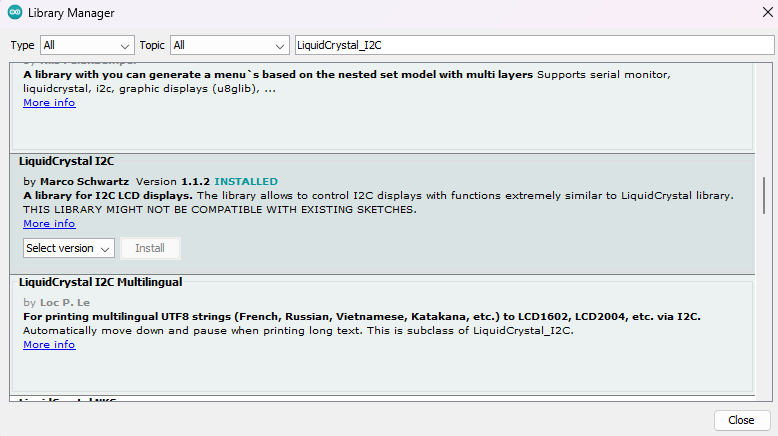

5. **Hướng dẫn lập trình**
=========

Để lập trình hiển thị chữ trên LCD chúng ta cần cài thư viện
LiquidCrystal_I2C.h, thao tác như sau: Sketch => Include Library =>
Manage Libraries…

Bảng Library Manager hiện ra chúng ta nhập LiquidCrystal_I2C => Enter.
Sau đó kéo xuống tìm thư viện LiquidCrystal_I2C và ấn Install.

**Code tham khảo:**

   #include <Wire.h> // Sử dụng thư viện Wire.h để giao tiếp I2C

   #include <LiquidCrystal_I2C.h> // Sử dụng thư viện
   LiquidCrystal_I2C.h để điều khiển màn hình LCD thông qua giao tiếp
   I2C

   LiquidCrystal_I2C lcd(0x27,16,2); // Khởi tạo một đối tượng lcd từ
   thư viện LiquidCrystal_I2C với địa chỉ I2C là 0x27, màn hình 16x2

   void setup()

   {

   lcd.init(); // Khởi động màn hình LCD

   lcd.backlight(); // Bật đèn nền của màn hình LCD

   }

   void loop()

   {

   lcd.setCursor(5,0); // Đặt con trỏ của màn hình LCD ở hàng đầu tiên,
   cột thứ 5

   lcd.print("STEMVN"); // In chuỗi "STEMVN" lên màn hình LCD

   lcd.setCursor(0,1); // Đặt con trỏ của màn hình LCD ở hàng thứ hai,
   cột đầu tiên

   lcd.print("Xin chao cac ban"); // In chuỗi "Xin chao cac ban" lên màn
   hình LCD

   }

.. 
