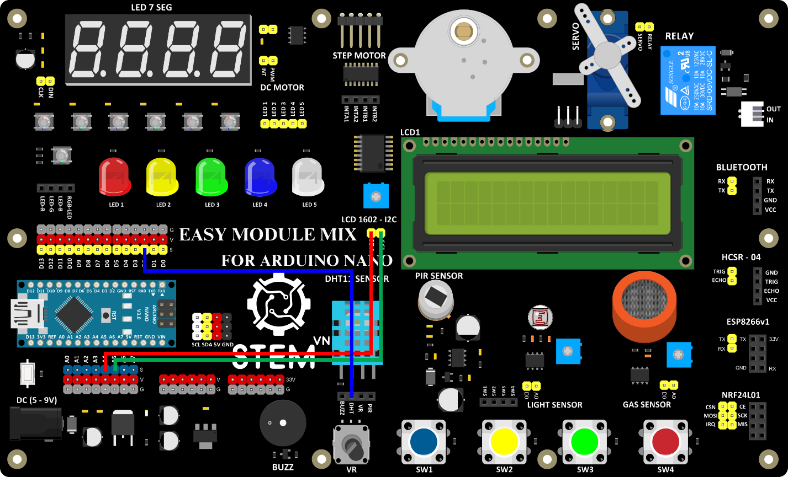

3. **Sơ đồ kết nối**
===

-  Sơ đồ kết nối

Cảm biến nhiệt độ, độ ẩm:

+----------------------------------+-----------------------------------+
| **CẢM BIẾN NHIỆT ĐỘ, ĐỘ ẨM**     | **ARDUINO**                       |
+==================================+===================================+
| DHT                              | D2                                |
+----------------------------------+-----------------------------------+

LCD:

+----------------------------------+-----------------------------------+
| **LCD**                          | **ARDUINO**                       |
+==================================+===================================+
| SCL                              | SCL                               |
+----------------------------------+-----------------------------------+
| SDA                              | SDA                               |
+----------------------------------+-----------------------------------+

