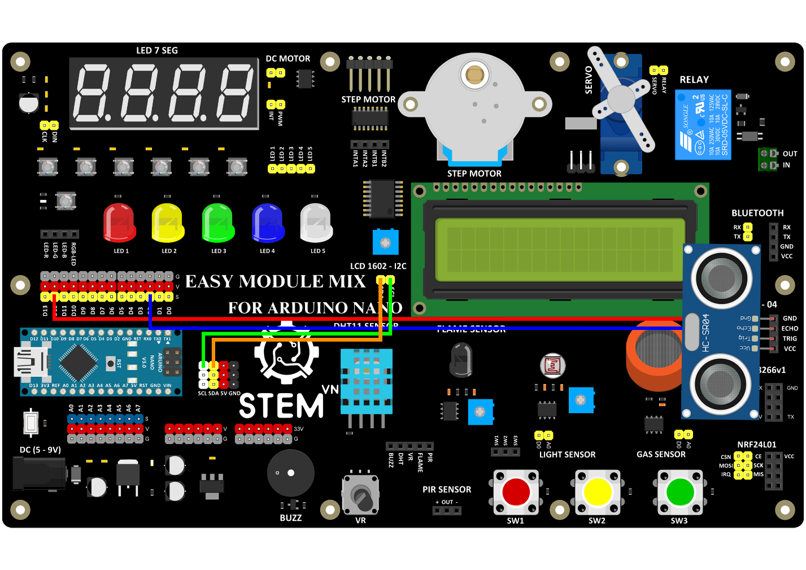

3. **Sơ đồ kết nối**
=========

-  Sơ đồ kết nối

LCD:

+----------------------------------+-----------------------------------+
| **LCD**                          | **ARDUINO**                       |
+==================================+===================================+
| SCL                              | SCL                               |
+----------------------------------+-----------------------------------+
| SDA                              | SDA                               |
+----------------------------------+-----------------------------------+

Cảm biến siêu âm:

+-----------------------------------+-----------------------------------+
| **CẢM BIẾN SIÊU ÂM**              | **ARDUINO**                       |
+===================================+===================================+
| GND                               | GND                               |
+-----------------------------------+-----------------------------------+
| VCC                               | VCC                               |
+-----------------------------------+-----------------------------------+
| TRIG                              | D2                                |
+-----------------------------------+-----------------------------------+
| ECHO                              | D12                               |
+-----------------------------------+-----------------------------------+

   
.. 