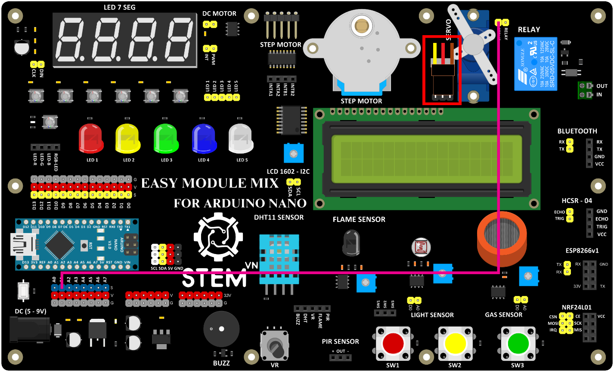

3. **Sơ đồ kết nối**
===

-  Sơ đồ kết nối

..

   **Chú ý:** Dây cắm động cơ theo thứ tự đã được đánh dấu

+----------------------------------+-----------------------------------+
| **ĐỘNG CƠ SERVO**                | **ARDUINO**                       |
+==================================+===================================+
| SERVO                            | A1                                |
+----------------------------------+-----------------------------------+

