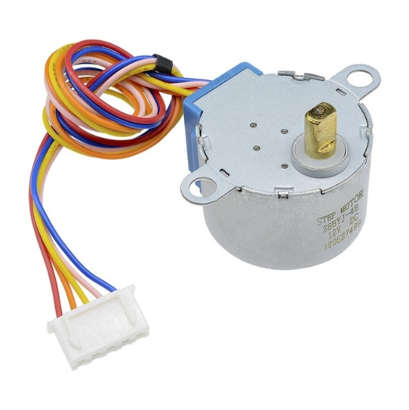

1. **Động cơ bước**

Động cơ bước (stepper motor) là loại động cơ điện quay theo các bước góc xác định. Chúng được điều khiển bằng cách cấp các tín hiệu điện theo thứ tự nhất định, khiến động cơ di chuyển từng bước một. Động cơ bước thường được sử dụng trong các ứng dụng cần độ chính xác cao như máy in 3D, máy CNC, và robot.

Động cơ bước hoạt động dựa trên nguyên lý từ trường. Bằng cách cấp điện cho các cuộn dây trong một thứ tự nhất định, từ trường tạo ra sẽ kéo rotor (phần quay của động cơ) theo các bước góc nhỏ. Điều này cho phép điều khiển chính xác vị trí và tốc độ của động cơ.
