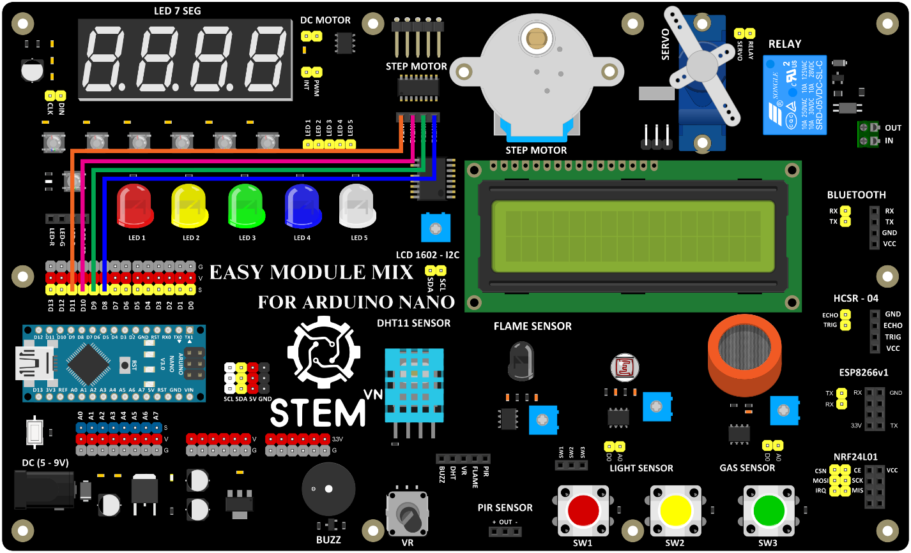

3. **Sơ đồ kết nối**
=========

+----------------------------------+-----------------------------------+
| **ĐỘNG CƠ BƯỚC**                 | **ARDUINO**                       |
+==================================+===================================+
| INTA1                            | D8                                |
+----------------------------------+-----------------------------------+
| INTA2                            | D9                                |
+----------------------------------+-----------------------------------+
| NITB1                            | D10                               |
+----------------------------------+-----------------------------------+
| INTB2                            | D11                               |
+----------------------------------+-----------------------------------+

.. 