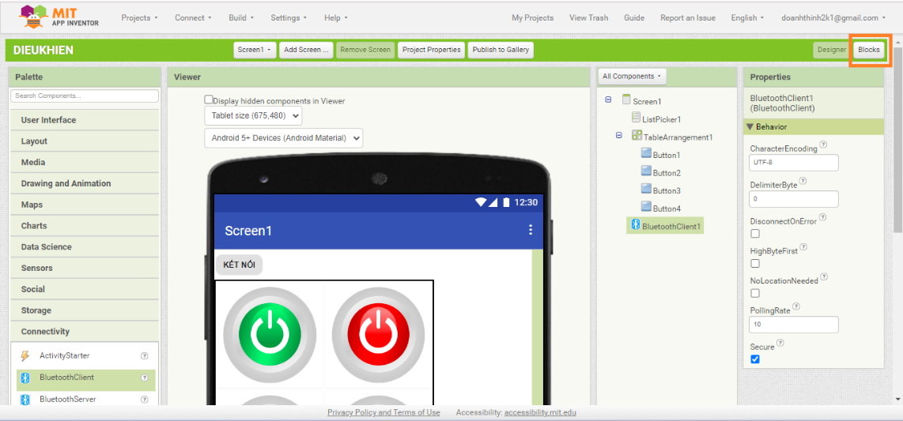
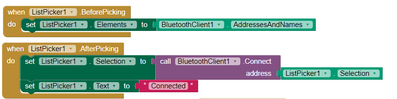
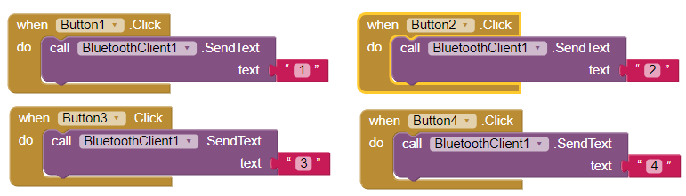

2. **Lập trình chức năng**
=========

Tiếp theo chúng ta sẽ code chức năng cho các nút tương ứng.

-  Chọn **Block** ở phần bên phải thanh công cụ sau đó giao diện lập
      trình sẽ hiện ra.

-  Code chức năng cho nút **KẾT NỐI**:

Các câu lệnh được sử dụng để cập nhật danh sách các phần tử của
ListPicker1 với các địa chỉ và tên Bluetooth có sẵn trước khi người dùng chọn một mục từ ListPicker1.

Hiểu đơn giản là khi chúng ta ấn vào nút KẾT NỐI sẽ có 1 danh sách
bluetooth hiện ra và chúng ta chỉ việc chọn vào bluetooth mà chúng ta muốn điều khiển.

-  Code chức năng cho các nút:

Click: có nghĩa quá trình ấn vào một button và lấy tay lên khi chúng ta ấn nút thì sẽ thực hiện lệnh đằng sau đó.

.. 