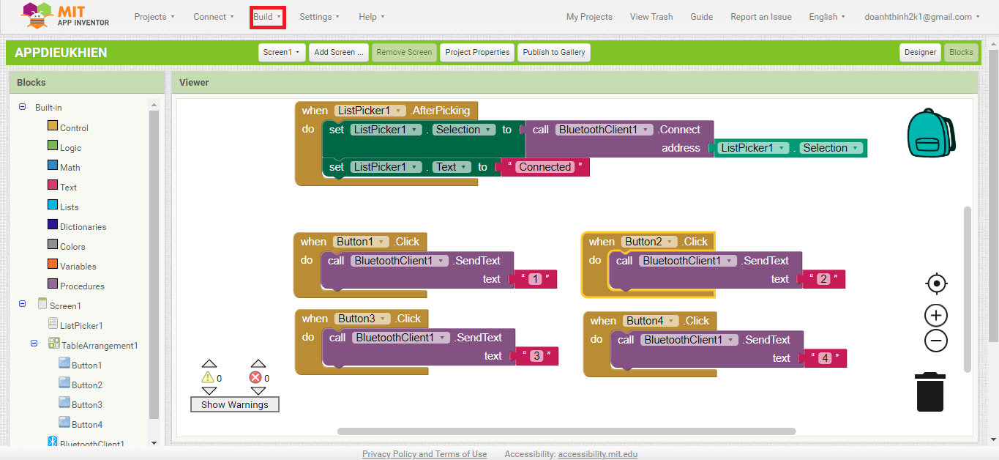
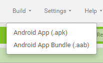
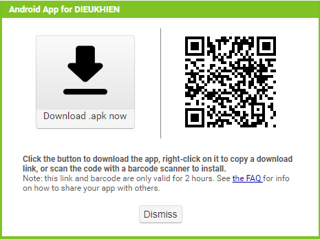

3. **Xuất thành bộ cài trên thiết bị di động**
=========

..

Ở phần thanh công cụ ngang trên cùng, chúng ta sẽ chọn **Build**

Sau đó chọn .apk

Sau khi xong sẽ có bảng thông báo hiện ra

Chúng ta có thể tải file để chia sẻ cho các thiết bị di động khác hoặc có thể dùng mã QR để chia sẻ app mà chúng ta mới tạo xong.

.. 