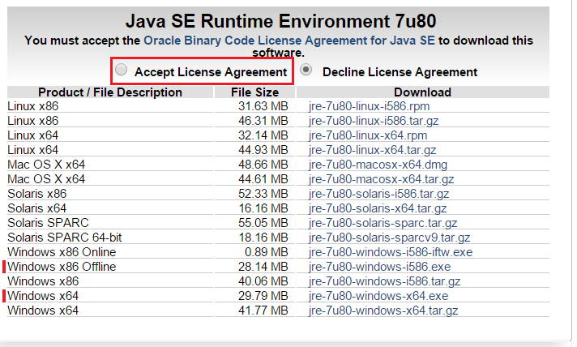
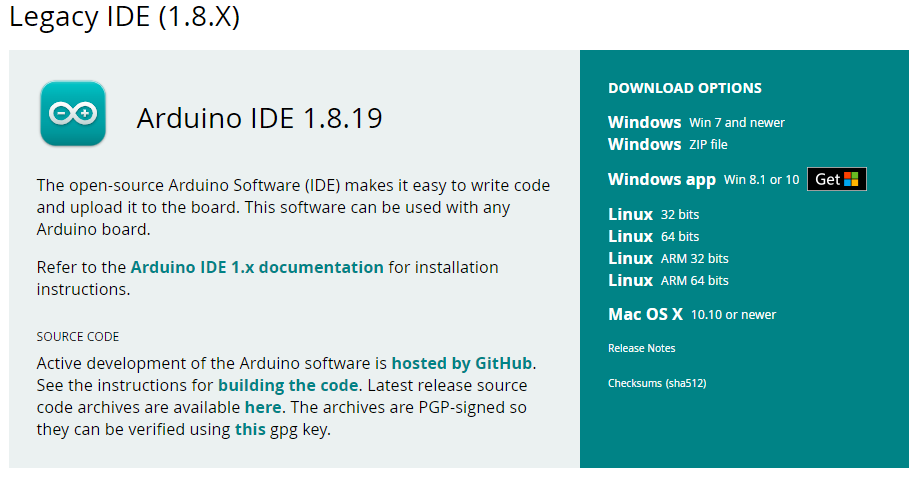
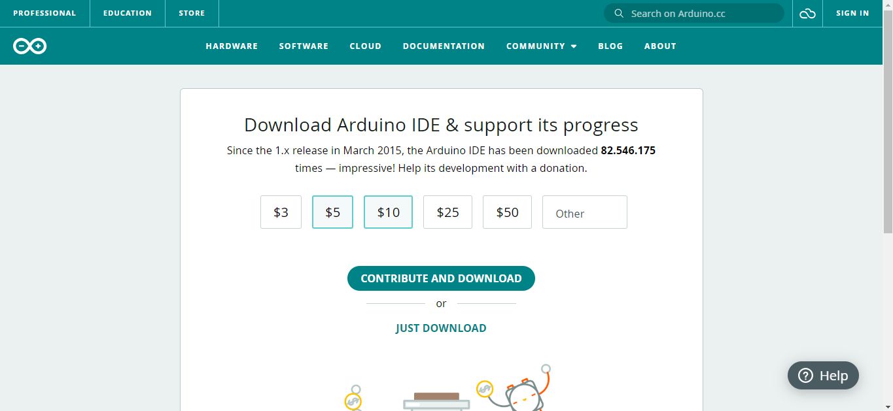
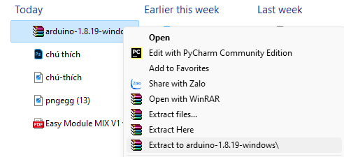
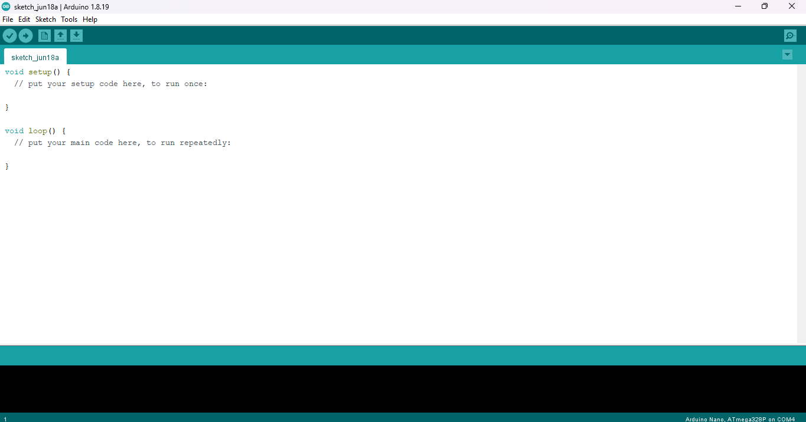
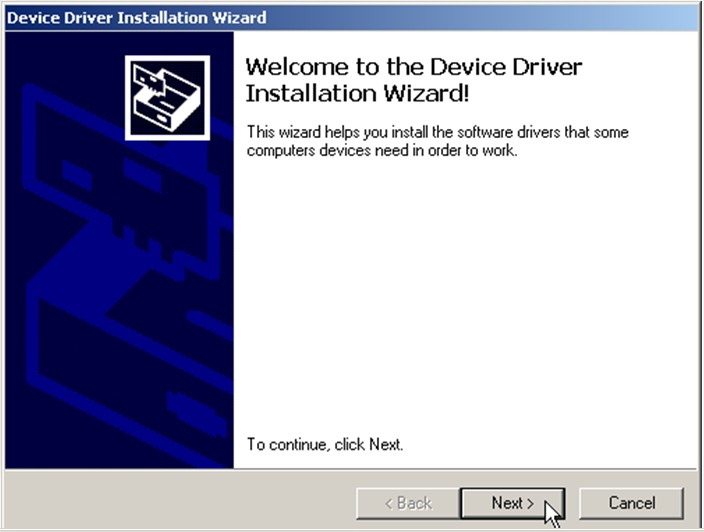
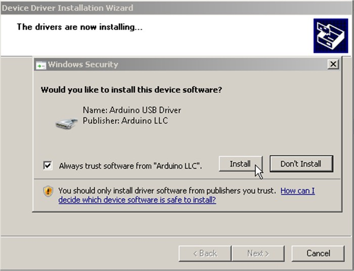
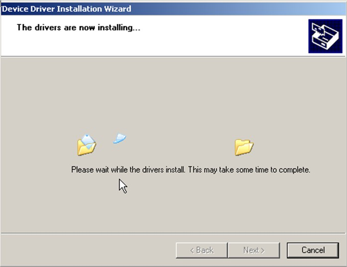
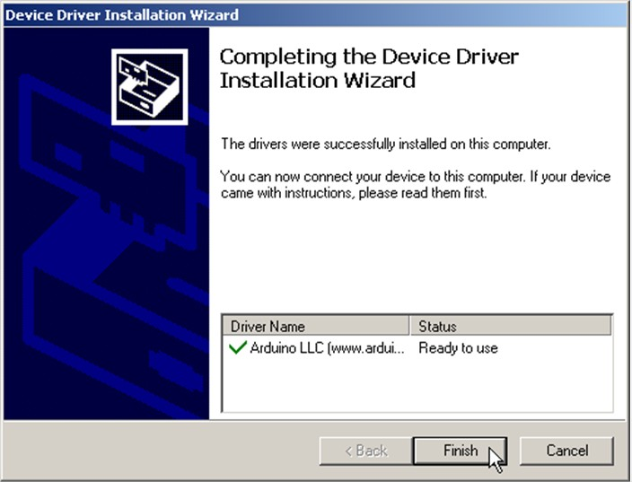

1. **Kết nối EASY MODULE MIX FOR ARDUINO NANO với máy tính, cài đặt phần mềm Arduino IDE.**
========

Để lập trình được cho các board EASY MODULE MIX FOR ARDUINO NANO, các
bạn cần phải có một công cụ gọi là Intergrated Development Environment
(IDE). Công cụ này được đội ngũ kĩ sư của Arduino phát triển và có thể
chạy trên Windows , MAC OS X và Linux. Ở đây mình sẽ hướng dẫn các bạn
cài đặt nó trên Windows. Các bạn cũng làm tương tự các bước này cho các
nền tảng khác

**1.1 Cài đặt Java Runtime Environment (JRE)**

Vì Arduino IDE được viết trên Java nên bạn cần phải cài đặt JRE trước
Arduino IDE.

Link tải: *https://oracle.com/java/technologies/javase/upgrade.html*

Chú ý: Nhiều bạn do không cài JRE trên máy nên thường hay gặp phải tình
trạng không chạy được Arduino IDE.

2 bản JRE phổ biến nhất là bản dành cho Windows 32bit (x86) và Windows
64bit (x64) đã đánh dấu trong hình, chọn "Accept License Agreement".

Bản JRE mới nhất là 7u80

**1.2 Cài đặt Arduino IDE**

-  Bước 1: Truy cập địa chỉ https://www.arduino.cc/en/software Đây là
   nơi lưu trữ cũng như cập nhật các bản IDE của Arduino. Bấm vào mục
   Windows ZIP file.

Bạn sẽ được chuyển đến một trang mời quyền góp tiền để phát triển phần
mềm cho Arduino, tiếp tục bấm JUST DOWNLOAD để bắt đầu tải.

-  Bước 2: Sau khi download xong, các bạn bấm chuột phải vào file vừa
   download arduino-1.8.19-windows và chọn “Extract to
   arduino-1.8.19-windows ” để giải nén.

-  Bước 3: Copy thư mục arduino-1.8.19-windows vừa giải nén đến nơi lưu
   trữ.
-  Bước 4: Chạy file Arduino IDE trong thư mục arduino-1.8.19-windows để
   khởi động Arduino IDE

**1.3 Cài đặt Driver**

Để máy tính của bạn và board Arduino giao tiếp được với nhau, chúng ta
cần phải cài đặt driver trước tiên.

Đầu tiên, các bạn chạy file C:\\Program Files
(x86)\\Arduino\\drivers\\dpinst-x86.exe (Windows x86). Cửa sổ “Device
Driver Installation Wizard” hiện ra, các bạn chọn Next để tiếp tục.

Khi có yêu cầu xác nhận cài đặt driver, chọn “Install”

Đợi khoảng 10 giây trong lúc quá trình cài đặt diễn ra …

Quá trình cài đặt đã hoàn tất. Bấm “Finish” để thoát.

.. 