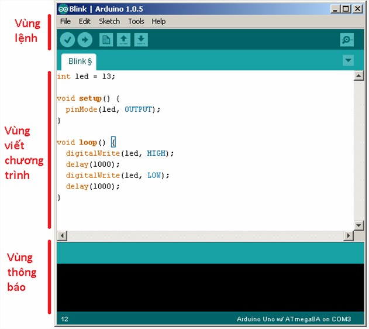
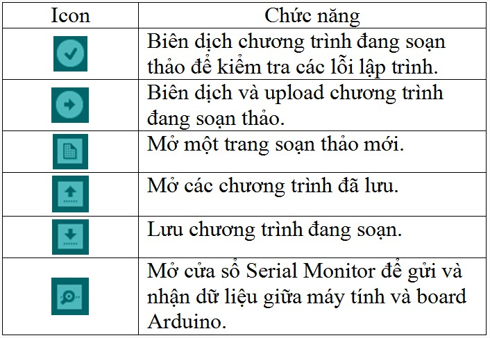
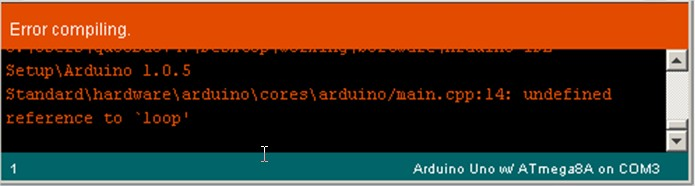
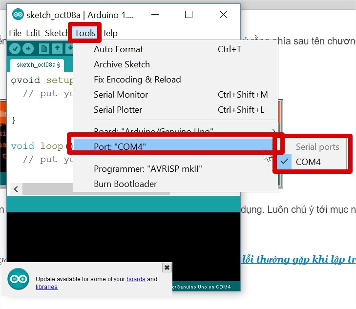

2. **Dạo một vòng Arduino IDE**
========

**2.1 Giao diện**

**2.2 Vùng lệnh**

Bao gồm các nút lệnh menu (File, Edit, Sketch, Tools, Help). Phía dưới
là các icon cho phép sử dụng nhanh các chức năng thường dùng của IDE.

**2.3 Vùng viết chương trình**

Bạn sẽ viết các đoạn mã của mình tại đây. Tên chương trình của bạn được
hiển thị ngay dưới dãy các Icon, ở đây nó tên là “Blink”. Để ý rằng phía
sau tên chương trình có một dấu “§”. Điều đó có nghĩa là đoạn chương
trình của bạn chưa được lưu lại.

**2.4 Vùng thông báo (debug)**

Những thông báo từ IDE sẽ được hiển thị tại đây. Để ý rằng góc dưới cùng
bên phải hiển thị loại board Arduino và cổng COM được sử dụng. Luôn chú
ý tới mục này bởi nếu chọn sai loại board hoặc cổng COM, bạn sẽ không
thể upload được code của mình.

Bạn có thể tìm thấy một vài hướng dẫn khắc phục các lỗi thường gặp khi
lập trình Arduino tại Lỗi của Arduino? Và các lỗi thường gặp khi lập
trình Arduino

**2.5 Một số lưu ý**

Khi lập trình, các bạn cần chọn port (cổng kết nối khi gắn board vào) và
board (tên board mà bạn sử dụng). Giả sử, bạn đang dùng mạch Arduino
Uno, và khi gắn board này vào máy tính bằng cáp USB nó được nhận là COM4
chỉnh như thế này là có thể lập trình được.

.. 