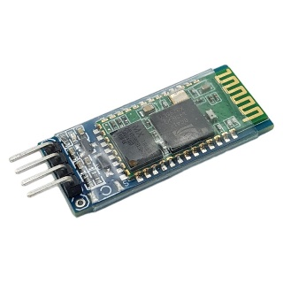

1. **Module Bluetooth HC-06**
=========

Module thu phát bluetooth HC-06 ra chân hoàn chỉnh giúp dễ dàng kết nối để thực hiện các thí nghiệm, module được thiết kế để cho thể hoạt động từ mức điện áp 3V3 => 5V. Khi kết nối với máy tính, HC-06 được sử dụng như 1 cổng COM ảo, việc truyền nhận với COM ảo sẽ giống như truyền nhận dữ liệu trực tiếp với UART trên module.

|

Lưu ý là khi thay đổi Baudrate cho COM ảo không làm thay đổi baudrate của UART, baudrate UART chỉ có thể thay đổi bằng AT command trên module. Module thu phát bluetooth HC-06 được setup mặc định là Slave không thể thay đổi được nên chỉ có thể giao tiếp với các thiết bị bluetooth ở dạng master như Smart phone, HC-05 master,… hai module bluetooth được set là Slave không thể giao tiếp với nhau..

.. 