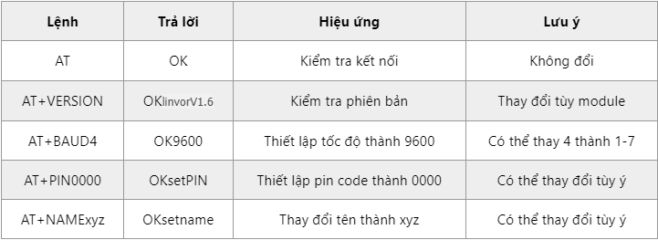

2. **Thông số kỹ thuật**
=========

-  Điện áp hoạt động: 3.3 ~ 5VDC.
-  Điện áp giao tiếp: TTL tương thích 3.3VDC và 5VDC.
-  Baudrate UART có thể chọn được: 1200, 2400, 4800, 9600, 19200, 38400, 57600, 115200
-  Dải tần sóng hoạt động: Bluetooth 2.4GHz
-  Sử dụng CSR mainstream bluetooth chip, bluetooth V2.0 protocol standards.
-  Dòng điện khi hoạt động: khi Pairing 30 mA, sau khi pairing hoạt động truyền nhận bình thường 8 mA
-  Kích thước của module chính: 28 mm x 15 mm x 2.35 mm
-  Thiết lập mặc định:
-  Baud rate: 9600, N, 8, 1.
-  Pairing code: 1234.

Một số câu lệnh thông dụng:

.. 