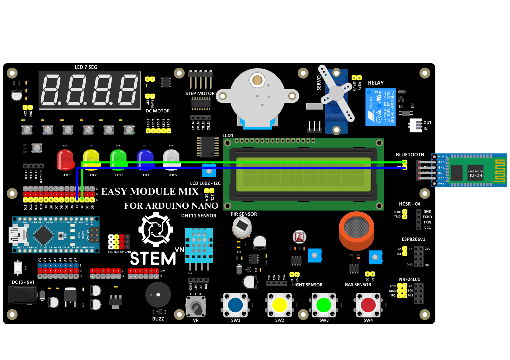
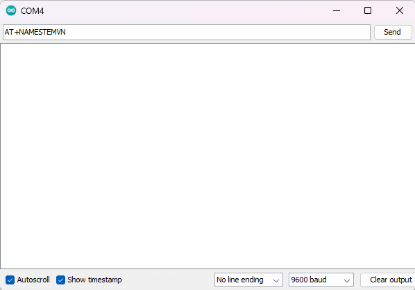
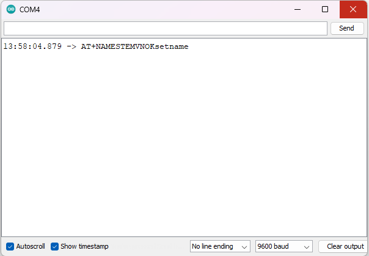

3. **Hướng dẫn lập trình**
=========

Kết nối phần cứng:

+-----------------------------------+----------------------------------+
| **BLUETOOTH**                     | **ARDUINO**                      |
+===================================+==================================+
| GND                               | GND                              |
+-----------------------------------+----------------------------------+
| VCC                               | VCC                              |
+-----------------------------------+----------------------------------+
| RX                                | D2                               |
+-----------------------------------+----------------------------------+
| TX                                | D3                               |
+-----------------------------------+----------------------------------+

Lập trình:

..

   #include <SoftwareSerial.h>

   int times;

   int rxPin = 3; //rx nối 2

   int txPin = 2; //tx nối 3

   SoftwareSerial hc06(rxPin, txPin);

   String message;

   char ch;

   void setup()

   {

      Serial.begin(9600);

      hc06.begin(9600); // đặt baudrate giao tiếp hc06

   }

   void loop() {

   if(Serial.available())
   {

      ch = Serial.read();

      hc06.write(ch);

      Serial.write(ch);

   }

   if(hc06.available())

   {

      Serial.write(hc06.read());

   }

   }

Sau khi nạp code xong chúng ta ấn **Ctrl + Shift + M** để mở cửa sổ
**Serial Monitor** và xem kết quả. Ví dụ để đổi tên thành STEMVN chúng
ta sẽ nhập lệnh sau **AT+NAMESTEMVN** rồi ấn Enter.

Thông báo OKsetname sẽ được hiện ra:

.. 