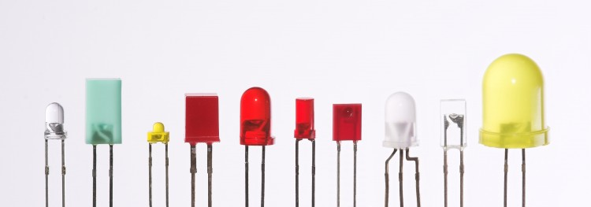
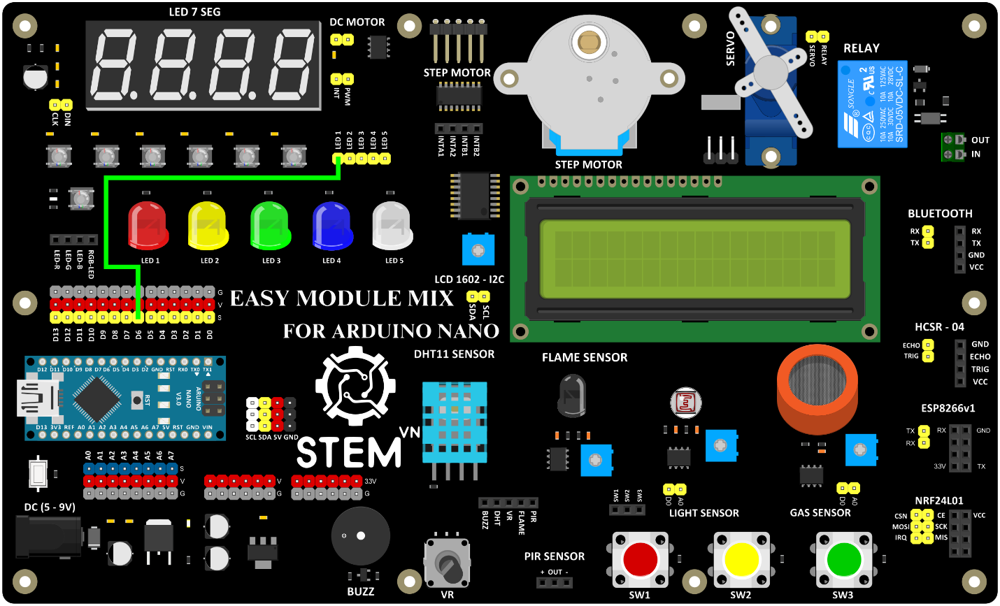

1. **Đèn LED**
========

1.1. **Đèn LED là gì ?**

Đèn LED thực chất cũng chỉ là đèn, nhưng khác với đèn dây tóc (trong các loại đèn pin cũ) thì đèn LED có phân cực âm (chân ngắn) và dương (chân dài). Nghĩa là bạn cần cấp điện vào cực dương và nối cực âm vào cực âm của nguồn. Đèn LED cũng có nhiều màu sắc, ví dụ như: trắng, đỏ, vàng, xanh lá, xanh dương, tím, cam, hồng,....

|

Các loại LED: Thường thì LED có 2 chân, loại nhiều chân là LED nhiều màu

1.2. **Cách sử dụng LED**

Vì LED có hiệu điện thế hoạt động khá thấp, tùy loại LED mà hiệu điện thế dao động ở mức (1.9 - 3.2 Vol).Vì vậy, khi bạn chạy ở hiệu điện thế 5V, thì bạn cần sử dụng một điện trở để giảm hiệu điện thế vào LED.

1.3. **Thông số kỹ thuật**

    -  Led đục
    -  Chiều dài chân: >20mm
    -  Đường kính: 5mm
    -  Điện áp led:
    -  Đỏ: 1.8 – 2 V
    -  Vàng: 1.8 – 2 V
    -  Trắng: 2.8 – 3.2 V
    -  Xanh lá: 2.8 – 3.2 V
    -  Xanh dương: 2.8 – 3.2 V
    -  Dòng: 10 – 20 mA
    -  Độ sáng : 2000 – 4000 milicandela

1.4. **Lập trình cơ bản với LED**

1.4.1. **Phần cứng**

    -  1 Mạch EASY MODULE MIX FOR ARDUINO NANO
    -  Dây jump cái cái

1.4.2 **Sơ đồ kết nối**

Dùng dây jump cái cái để kết nối chân S của D6 với chân LED1 ( hoặc có thể nối sang một trong các chân LED còn lại từ 2 đến 5)

+-----------------------------------+-----------------------------------+
| **LED**                           | **ARDUINO**                       |
+===================================+===================================+
| LED1                              | D6                                |
+-----------------------------------+-----------------------------------+

|

1.4.3. **Hướng dẫn lập trình**

void setup() {
    pinMode(6, OUTPUT);
}
void loop() {
    digitalWrite(6, HIGH);
    delay(1000);
    digitalWrite(6, LOW);
    delay(1000);
}

.. 