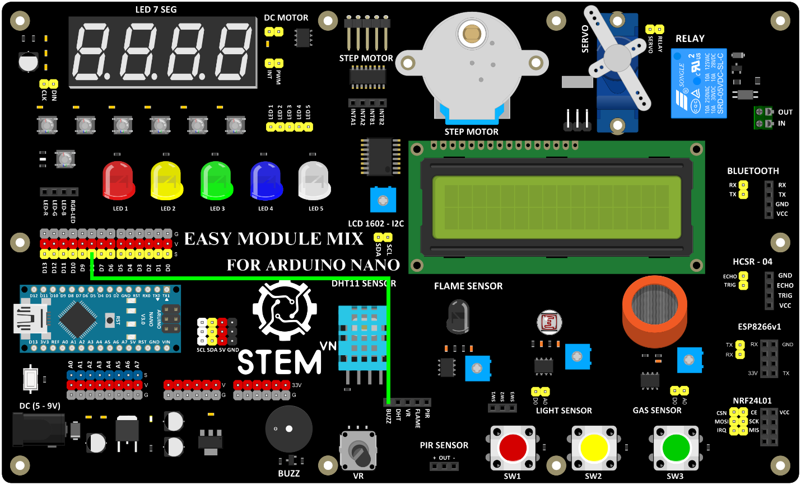

2. **Còi 5V**
=====

2.1. **Giới thiệu**
Còi 5V là linh kiện thường được dùng trong các mạch điện tử với mục đích
tạo ra tín hiệu âm thanh

2.2. **Thông số kỹ thuật**
    -  Điện áp sử dụng: 3-12VDC
    -  Dòng tiêu thụ: <25mA
    -  Tần số âm thanh: 2300H z ± 500
    -  Âm thanh đầu ra: Bíp bíp
    -  Biên độ âm thanh: > 80dB
    -  Nhiệt độ hoạt động: -20 đến 70 độ C
    -  Màu sắc: Đen
    -  Kích thước của còi chip 9.5x12mm: 9.5x12mm
    -  2 cực: Cực âm, cực dương
    -  Chân dài: cực dương
    -  Chân ngắn: Cực âm

2.3. **Lập trình cơ bản với còi 5V**
2.3.1 **Sơ đồ kết nối**
Dùng dây jump cái cái để kết nối chân S của D8 với chân BUZZ

+-----------------------------------+-----------------------------------+
| **Còi 5V**                        | **ARDUINO**                       |
+===================================+===================================+
| BUZZ                              | D8                                |
+-----------------------------------+-----------------------------------+

    2.3.2 **Hướng dẫn lâp trình**

void setup() {

pinMode(8, OUTPUT);

}

void loop() {

digitalWrite(8, HIGH);

delay(1000);

digitalWrite(8, LOW);

delay(1000);

}