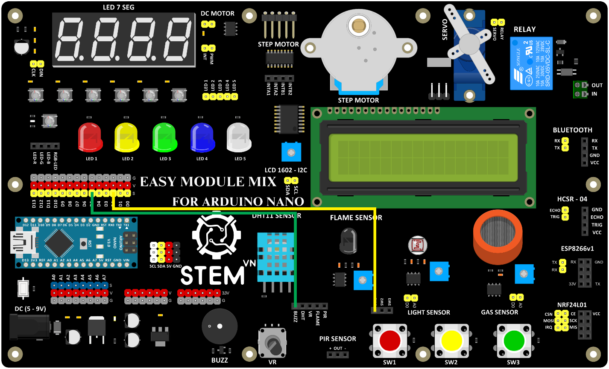

5. **Điều khiển LED và các thiết bị khác bằng nút ấn**
========

   5.1. **Điều khiển LED bằng nút ấn**

-  Sơ đồ kết nối

Nút nhấn

+----------------------------------+-----------------------------------+
| **NÚT NHẤN**                     | **ARDUINO**                       |
+==================================+===================================+
| SW1                              | D2                                |
+----------------------------------+-----------------------------------+

LED

+----------------------------------+-----------------------------------+
| **LED**                          | **ARDUINO**                       |
+==================================+===================================+
| LED4                             | D8                                |
+----------------------------------+-----------------------------------+

..

   .. image:: ../media/image22.png
      :width: 5.81162in
      :height: 3.52485in

-  Hướng dẫn lập trình

..

   const int ledPin = 8; // Chân nối LED

   const int buttonPin = 2; // Chân nối nút nhấn

   int previousButtonState = LOW; // Biến để lưu trạng thái trước của
   nút nhấn

   int ledState = LOW; // Biến để lưu trạng thái của LED

   void setup() {

   pinMode(ledPin, OUTPUT); // Khai báo chân là đầu ra cho LED

   pinMode(buttonPin, INPUT); // Khai báo chân là đầu vào cho nút nhấn

   }

   void loop() {

   int buttonState = digitalRead(buttonPin); // Đọc trạng thái hiện tại
   của nút nhấn

   // Nếu nút nhấn được nhấn và trạng thái trước đó là LOW (chưa nhấn)

   if (buttonState == HIGH && previousButtonState == LOW) {

   ledState = !ledState; // Đảo trạng thái của LED

   digitalWrite(ledPin, ledState); // Ghi trạng thái mới vào chân LED

   delay(50); // Chờ một chút để tránh đọc các giá trị không mong muốn
   từ nút nhấn do nhiễu

   }

   previousButtonState = buttonState; // Lưu trạng thái hiện tại của nút
   nhấn để sử dụng trong lần lặp tiếp theo

   }

    5.2. **Điều khiển còi 5v bằng nút ấn**

-  Sơ đồ kết nối

Nút nhấn

+----------------------------------+-----------------------------------+
| **NÚT NHẤN**                     | **ARDUINO**                       |
+==================================+===================================+
| SW1                              | D2                                |
+----------------------------------+-----------------------------------+

Còi 5v

+----------------------------------+-----------------------------------+
| **CÒI 5V**                       | **ARDUINO**                       |
+==================================+===================================+
| BUZZ                             | D5                                |
+----------------------------------+-----------------------------------+

-  Hướng dẫn lập trình

..

   const int buzzerPin = 5; // Chân nối còi

   const int buttonPin = 2; // Chân nối nút nhấn

   int previousButtonState = LOW; // Biến để lưu trạng thái trước của
   nút nhấn

   int buttonPressCount = 0; // Biến để theo dõi số lần nút nhấn đã được
   nhấn

   void setup() {

   pinMode(buzzerPin, OUTPUT); // Khai báo chân là đầu ra cho còi

   pinMode(buttonPin, INPUT_PULLUP); // Khai báo chân là đầu vào với
   resistor nội pull-up cho nút nhấn

   }

   void loop() {

   int buttonState = digitalRead(buttonPin); // Đọc trạng thái hiện tại
   của nút nhấn

   // Nếu nút nhấn được nhấn và trạng thái trước đó là LOW (chưa nhấn)

   if (buttonState == HIGH && previousButtonState == LOW) {

   buttonPressCount++; // Tăng số lần nút nhấn đã được nhấn lên 1

   // Nếu số lần nhấn đã đạt đến 2, tắt còi

   if (buttonPressCount == 2) {

   noTone(buzzerPin); // Tắt âm thanh của còi

   buttonPressCount = 0; // Đặt lại số lần nhấn về 0 để chuẩn bị cho lần
   nhấn tiếp theo

   } else {

   // Nếu số lần nhấn chưa đạt đến 2, phát ra âm thanh từ còi

   tone(buzzerPin, 1000); // Bạn có thể thay đổi tần số âm thanh tại đây

   }

   }

   previousButtonState = buttonState; // Lưu trạng thái hiện tại của nút
   nhấn để sử dụng trong lần lặp tiếp theo

   }
