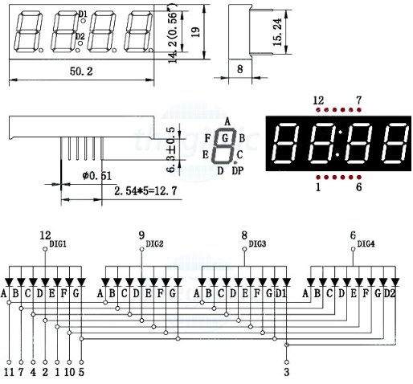

1. **LED 7 thanh**
========

Màn hình LED 7 đoạn là loại thiết bị hiển thị điện tử được sử dụng phổ biến để thể hiện các chữ số và một số ký tự chữ cái. Nó bao gồm bảy đoạn LED (Điốt phát sáng) có thể định địa chỉ riêng lẻ được sắp xếp theo hình chữ số "8". Mỗi đoạn có thể được chiếu sáng độc lập, cho phép hiển thị các số từ 0 đến 9 và một số ký tự bổ sung như AF (đối với màn hình thập lục phân), cũng như các ký hiệu nhất định.

Bảy đoạn thường được gắn nhãn là "A" đến "G", với mỗi đoạn đại diện cho một phần cụ thể của chữ số. Bằng cách bật hoặc tắt có chọn lọc các phân đoạn thích hợp, nhiều số và ký tự khác nhau có thể được hiển thị.

|

.. 