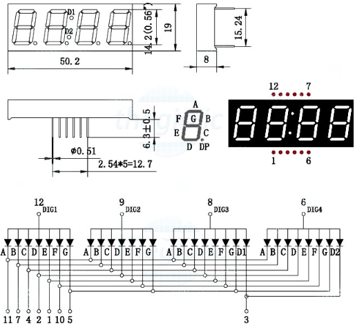

3. **Thông số kỹ thuật**
========

-  Loại màn hình : LED 7 đoạn

-  Số chữ số : 4 chữ số

-  Chiều cao chữ số : Thông thường khoảng 0,56 inch (14,2mm)

-  Loại phổ biến : Cathode chung hoặc Anode chung

-  Màu sắc : Đỏ (các màu khác như xanh lá, xanh dương cũng có thể tùy
   theo nhà sản xuất)

-  Đặc điểm điện từ:

-  Điện áp chuyển tiếp (Vf) : Thường là 1,8V đến 2,2V trên mỗi phân đoạn
   (Đỏ)

-  Dòng chuyển tiếp (Nếu) : Thông thường 10mA đến 20mA trên mỗi phân
   đoạn

-  Điện áp ngược (Vr) : tối đa 5V

-  Tản điện : Phụ thuộc vào số lượng đoạn được thắp sáng

-  Cấu hình chân:

-  Chân 1 : Cathode số 1/Anode chung

-  Chân 2 : Đoạn E

-  Chân 3 : Cathode số 2/Anode chung

-  Chân 4 : Đoạn D

-  Chân 5 : Đoạn C

-  Chân 6 : Dấu thập phân (DP)

-  Chân 7 : Đoạn G

-  Chân 8 : Cathode số 3/Anode chung

-  Chân 9 : Đoạn B

-  Chân 10 : Đoạn A

-  Chân 11 : Cathode số 4/Anode chung

-  Chân 12 : Đoạn F

