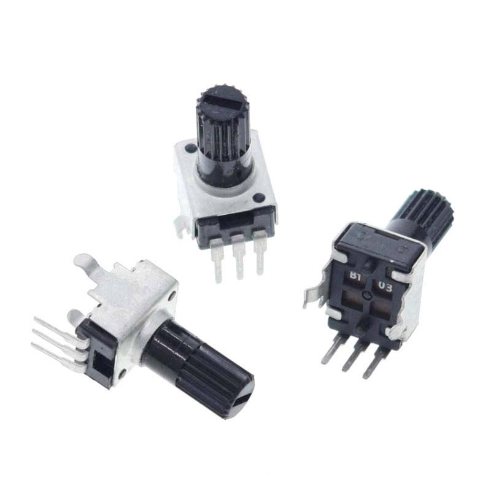
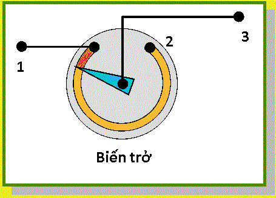

1. **Biến trở**
========

Biến trở chỉ đơn giản chỉ là một điện trở có thể thay đổi được trị số.
Mạch Arduino không đọc trực tiếp điện trở này mà đọc gián tiếp qua điện
áp mà biến trở gây ra.

   áp trục đứng 12.5mm
   :width: 3.875in
   :height: 3.05174in

Cấu tạo của biến trở:

Phần màu vàng là một lớp điện trở. Cây kim màu xanh được đè chặt xuống
phần điện trở này. Giả sử có dòng điện đi từ 1 đến 3 thì nó sẽ phải qua
phần màu vàng (được tô đỏ) và đó chính là điện trở hiện tại của biến
trở. Bạn chỉ việc vặn cây kim để tăng giảm độ dài của vùng màu đỏ, qua
đó tăng giảm giá trị điện trở.