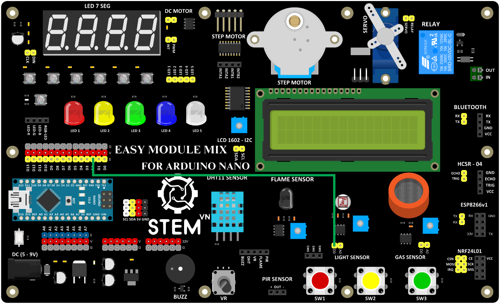
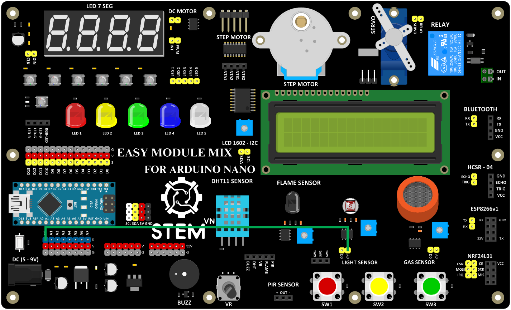

3. **Sơ đồ kết nối**
========

-  Đối với tín hiệu số (thấp hoặc cao; 0 hoặc 1) kết nối chân D0 của cảm biến với 1 trong các chân tín hiệu số.

+-----------------------------------+-----------------------------------+
| **CẢM BIẾN ÁNH SÁNG**             | **ARDUINO**                       |
+===================================+===================================+
| D0                                | D2                                |
+-----------------------------------+-----------------------------------+

|

-  Đối với tín tương tự (Ngõ ra Analog 0 – 5V tỷ lệ thuận với cường độ ánh sáng, ngõ TTL tích cực mức thấp; giá trị từ 0-1023) kết nối chân A0 của cảm biến với 1 trong các chân tín hiệu tương tự.

+-----------------------------------+-----------------------------------+
| **CẢM BIẾN ÁNH SÁNG**             | **ARDUINO**                       |
+===================================+===================================+
| A0                                | A0                                |
+-----------------------------------+-----------------------------------+

|

.. 