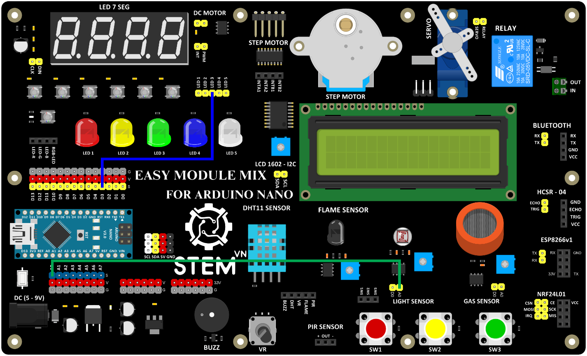

5. **Điều chỉnh độ sáng LED dựa trên giá trị ánh sáng**
========

Dưới đây là một chương trình mẫu điều chỉnh đèn LED dựa trên giá trị analog của cảm biến ánh sáng.

Sơ đồ kết nối
- Cảm biến ánh sáng:

+-----------------------------------+-----------------------------------+
| **CẢM BIẾN ÁNH SÁNG**             | **ARDUINO**                       |
+===================================+===================================+
| A0                                | A0                                |
+-----------------------------------+-----------------------------------+

..

- Đèn LED:

+-----------------------------------+-----------------------------------+
| **LED**                           | **ARDUINO**                       |
+===================================+===================================+
| LED 3                             | D3                                |
+-----------------------------------+-----------------------------------+

|

-  Hướng dẫn lập trình

..

   int LED = 3; //biểu thị số chân được kết nối với đèn LED
   int val = 0; //khai báo một biến số nguyên có tên val và khởi tạo nó bằng 0

   void setup(){
      pinMode(LED,OUTPUT);
      Serial.begin(9600);
   }
   void loop(){
      val = analogRead(0); //Đọc giá trị điện áp analog từ chân analog 0 và lưu nó vào biến val.
      Serial.println(val);

      if(val<200){ //Kiểm tra xem giá trị của val có nhỏ hơn 200 hay không
         digitalWrite(LED,LOW);
      }else{
         digitalWrite(LED,HIGH);
      }
      delay(10);
   }

.. 